# Machine Learning
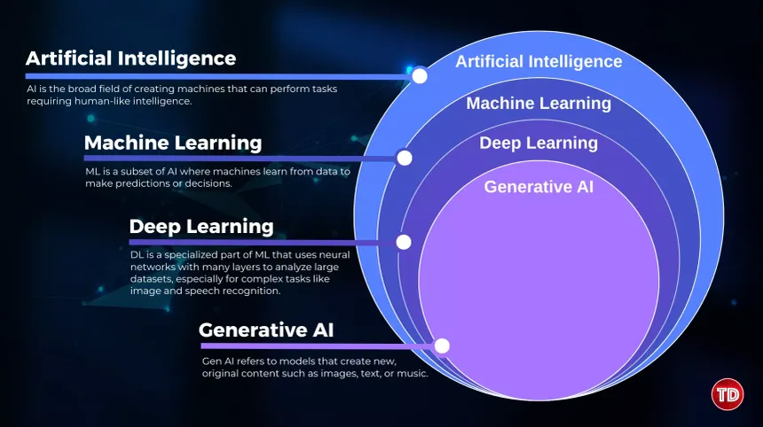

## What is Machine Learning
machine learning is a field of computer science that uses statistical techniques to give computer systems the ability to "learn" with data, without being explicitly programmed. In simpler terms, it is the process of learning from data.

- **Explicit Programming:** In a conventional software development approach, a human writes the logic (code) for specific scenarios. You provide the input to this logic, and it produces an output. If the scenario changes, the human must manually rewrite the logic.
- **Machine Learning:** The flow is reversed. You provide the system with data (which contains both the input and the desired output) and an algorithm. The algorithm explores the data, identifies patterns, and generates the logic itself,.

### Key Characteristics and Use Cases
Machine learning is particularly powerful in scenarios where traditional programming falls short:
- **Dynamic Rules (e.g., Spam Classifiers):** In tasks like email spam detection, hard-coding rules (e.g., flagging the word 'huge') is inefficient because spammers change their tactics (e.g., using 'big' or 'massive' instead),. A machine learning model learns from the data; if the data changes, the logic updates automatically without human intervention.
- **Complex Scenarios (e.g., Image Classification):** For tasks like identifying a dog in a photograph, it is impossible to explicitly code for every breed, colour, and angle. Machine learning mimics the human cognitive process of learning by "tagging" and recognising patterns across vast amounts of data.
- **Data Mining:** Machine learning acts as a crucial tool for data mining, which involves extracting hidden patterns or information from data that cannot be easily identified through simple data analysis or graphing,.
---


## AI vs ML vs DL

### 1. Artificial Intelligence (AI)
- **Definition:** AI is the broad goal of incorporating intelligence into machines so they can mimic human capabilities.
- **Symbolic AI (The Past):** In the 1950s and following decades, the approach was "Symbolic AI" or "Expert Systems." This involved humans hard-coding knowledge and strict logic (rules) into a system.
- **Limitations:** While successful in games like Chess, Symbolic AI failed in "fuzzy" or complex scenarios, such as recognizing a dog in an image. It is impossible for a human to explicitly write code defining every possible angle, breed, or variation of a dog.
### 2. Machine Learning (ML)
- **The Solution to Symbolic AI:** ML emerged to solve the limitations of hard-coded rules. It is a subset of AI that uses statistical techniques to find patterns in data.
- **How it Works:** Instead of a human writing the rules (explicit programming), the system is fed data (in puts and outputs). The algorithm analyzes the data and generates the rules or logic itself.
- **Feature Dependency:** A key characteristic (and limitation) of ML is that it often relies on manually defined "features." For example, to predict a student's placement, a human must decide that "CGPA" and "IQ" are the relevant inputs (features) to feed the model.
### 3. Deep Learning (DL)
- **Why it Exists:** Deep Learning is a specialized subset of ML designed to solve the problem of manual feature extraction. In complex tasks (like image recognition), it is difficult for humans to determine exactly which features define an object.
- **Automatic Feature Extraction:** The primary advantage of DL is that it automatically learns and extracts features from raw data. As you add more layers to the model, it learns increasingly complex representations (e.g., edges, then shapes, then the object) without human intervention.
- **Biological Inspiration:** DL is inspired by the structure of the human brain (neurons), though the speaker clarifies that it is ultimately a mathematical model and does not function exactly like a biological brain.
- **Data Scaling:** DL models perform significantly better as the volume of data increases. While ML performance tends to plateau after a certain point, DL continues to improve with more data.
Conclusion The video concludes that while DL is powerful for unstructured data (images, audio) and massive datasets, it is not always the best tool. For scenarios with smaller datasets or structured tabular data (common in banking or insurance), Machine Learning remains the preferred and more efficient choice.
---


## Types Of Machine Learning
### 1. Supervised Machine Learning
**Definition:**  
Supervised learning uses labeled data, meaning each input has a known output.

#### a) Regression
**Goal:** Predict a continuous numeric value.

**Examples:**
- House price prediction (₹ value)
- Salary prediction based on experience
- Temperature forecasting

**Algorithms:**
- Linear Regression
- Ridge / Lasso Regression
- Decision Tree Regressor


#### b) Classification
**Goal:** Predict a discrete class or label.

**Examples:**
- Email spam detection (Spam / Not Spam)
- Disease detection (Positive / Negative)
- Sentiment analysis (Positive / Neutral / Negative)

**Algorithms:**
- Logistic Regression
- KNN
- SVM
- Random Forest
- XGBoost
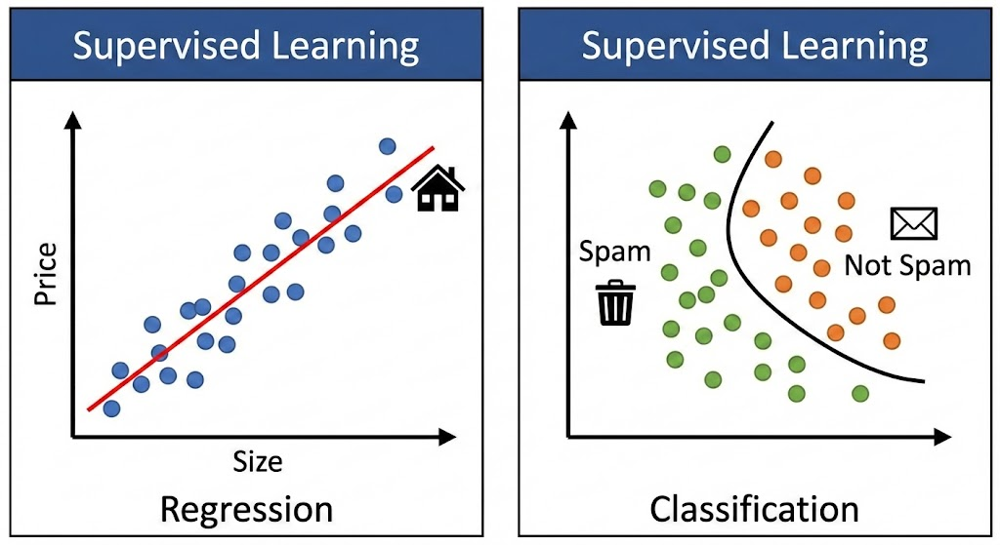

### 2. Unsupervised Machine Learning
**Definition:**  
Unsupervised learning works with unlabeled data and finds hidden patterns.

#### a) Clustering
**Goal:** Group similar data points.

**Examples:**
- Customer segmentation
- News article grouping
- Image segmentation

**Algorithms:**
- K-Means
- Hierarchical Clustering
- DBSCAN

#### b) Dimensionality Reduction
**Goal:** Dimensionality = number of features (columns) in your dataset.
Dimensionality reduction = reduce features without losing important information.

Example:
- Original data → 1,000 features
- After reduction → 50 meaningful features
- for example we replace the house room and the washroom with the total area of the house in house price prediction

**Examples:**
- Reducing 100 features to 10
- Data visualization in 2D/3D
- Improving model performance

**Algorithms:**
- PCA
- LDA
- t-SNE

#### c) Anomaly Detection
**Goal:** Detect data points that behave very differently from the majority.

These are:
- Rare
- Unexpected
- Potentially dangerous or important

**Examples:**
- Credit card fraud detection
- Network intrusion detection
- Manufacturing defect detection

**Algorithms:**
- Isolation Forest
- One-Class SVM
- Autoencoders

#### d) Association Rule Learning
**Goal:** Discover relationships between items.

**Examples:**
- Market basket analysis (Bread → Butter)
- Recommendation systems

**Algorithms:**
- Apriori
- FP-Growth
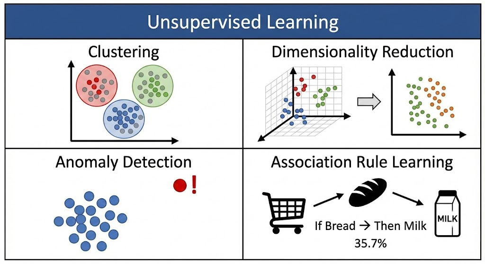

### 3. Semi-Supervised Learning
**Definition:**  
Semi-supervised learning trains a model using a small amount of labeled data and a large amount of unlabeled data, assuming both come from the same underlying distribution.

**Image Classification (Cats vs Dogs)**
You have:
- 1,000 images total
- Only 100 labeled
- 50 cats
- 50 dogs
- 900 unlabeled images

**What happens:**
- Train an initial model using the 100 labeled images
- The model predicts labels for the 900 unlabeled images
- Keep high-confidence predictions
- Retrain the model using:
- Original labeled data
- confidently pseudo-labeled data
- Repeat

This improves performance without manual labeling.

**Examples:**
- Image classification with few labeled images
- Speech recognition
- Medical image diagnosis
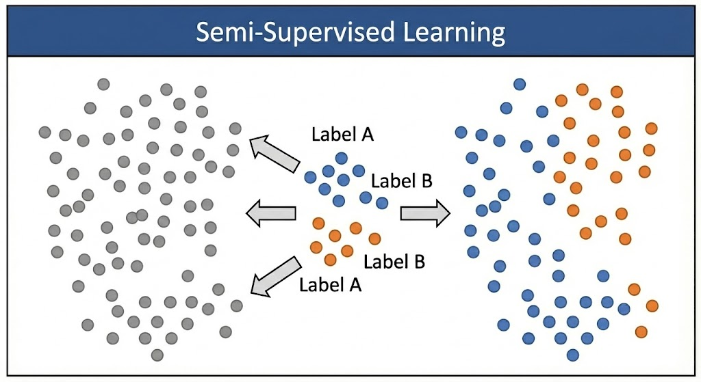


### 4. Reinforcement Learning
**Definition:**  
An agent learns by interacting with an environment using rewards and penalties.

**Key Concepts:**
- Agent
- Environment
- Action
- Reward

**Examples:**
- Game playing (Chess, AlphaGo)
- Self-driving cars
- Robot navigation
- Trading bots

**Algorithms:**
- Q-Learning
- Deep Q Networks (DQN)
- Policy Gradient Methods
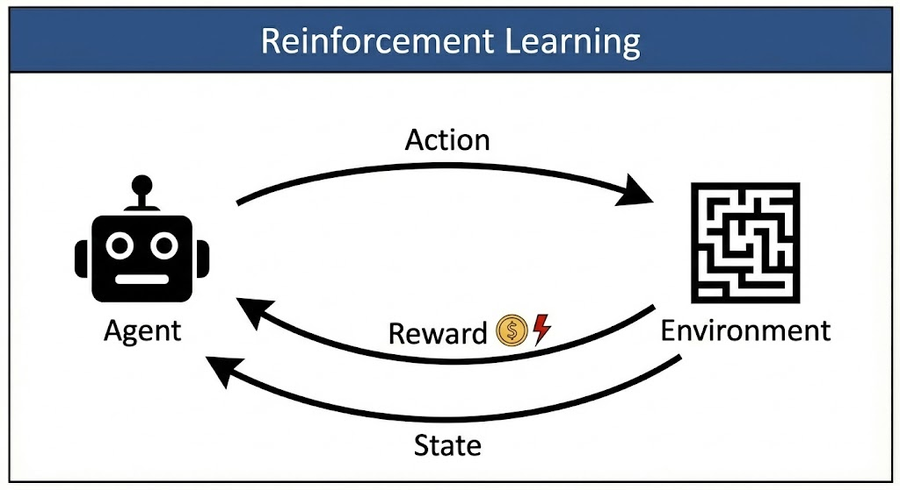

### Summary Table

| Learning Type | Data | Example |
|--------------|------|---------|
| Supervised | Labeled | Spam detection |
| Unsupervised | Unlabeled | Customer clustering |
| Semi-Supervised | Few labels | Image classification |
| Reinforcement | Reward-based | Game AI |
---


## Offline Vs Online Learning
### Batch Machine Learning (offline learning)

#### What is Batch Learning?

**Batch Learning (Offline Learning)** is a machine learning approach where the model is trained **once using the entire dataset at the same time**.  
After training, the model **does not update itself** when new data arrives.
To incorporate new data, the model must be **retrained from scratch** using the old data plus the new data.

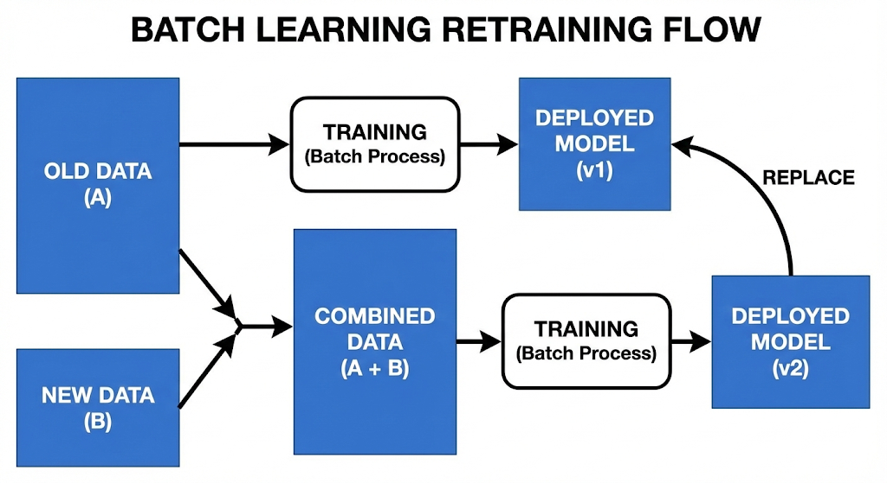
---

#### What Batch Learning Is NOT

- Not online learning  
- Not incremental learning  
- Not real-time learning  

Batch learning follows the pattern:

**Collect data → Train model → Deploy → Retrain later**

---

#### Simple Example

##### Email Spam Detection

1. Collect 1 million labeled emails (spam / not spam)
2. Train the model using the **entire dataset**
3. Deploy the trained model
4. New emails arrive every day
5. Model predictions continue using the old model
6. After a fixed period (e.g., monthly), retrain the model with updated data

This workflow is **batch learning**.

---

#### How Batch Learning Works (Step-by-Step)

1. Data is collected and stored
2. Entire dataset is loaded into memory or processed in batches
3. Model is trained once
4. Trained model is saved
5. Model is used only for inference
6. Periodic retraining if required

---

#### Real-World Examples

- House price prediction (monthly retraining)
- Credit risk assessment
- Student performance prediction
- Recommendation systems (nightly retraining)
- Traditional ML pipelines using Scikit-learn

---

#### Advantages of Batch Learning

##### 1. Simple to implement
- Easy pipeline
- Less engineering complexity

##### 2. Stable models
- Model behavior does not change frequently
- Predictable performance

##### 3. Better optimization
- Uses entire dataset
- Accurate gradient estimation

##### 4. Reproducibility
- Same data produces same model
- Easier debugging

---

#### Disadvantages of Batch Learning

##### 1. Cannot adapt quickly
- Model becomes outdated as data changes

##### 2. Expensive retraining
- Requires full dataset
- High computational cost

##### 3. Not suitable for streaming data
- Poor fit for real-time systems

##### 4. Downtime during retraining
- Requires redeployment

---

#### Batch Learning vs Online Learning

| Aspect | Batch Learning | Online Learning |
|------|---------------|----------------|
| Data | Entire dataset | One or few samples |
| Updates | Periodic | Continuous |
| Memory | High | Low |
| Adaptation | Slow | Fast |
| Complexity | Low | High |

---

#### Common Algorithms Used in Batch Learning

- Linear Regression
- Logistic Regression
- Decision Trees
- Random Forest
- Support Vector Machines
- XGBoost (batch mode)

---

#### Important Clarification

**Batch Learning ≠ Batch Gradient Descent**

- Batch learning refers to **how data is used**
- Batch gradient descent refers to **how optimization is done**

They are independent concepts.

---

#### One-Line Interview Definition

> Batch learning trains a model using the entire dataset at once and requires retraining from scratch when new data arrives.

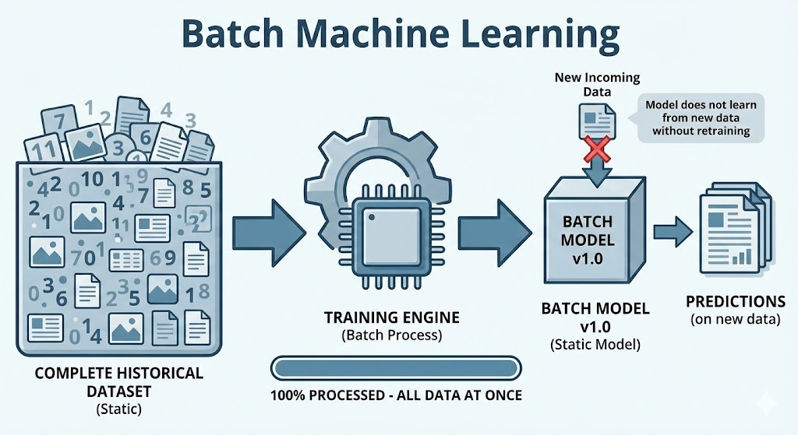

---


### Online Machine Learning
Online Learning is a technique where the machine learning model is trained incrementally rather than on the entire dataset at once. Unlike Batch Learning, where the model is static once deployed, Online Learning allows the model to continue learning and improving dynamically as new data arrives on the server.

Unlike Batch Learning, the model does not need to be retrained from scratch when new data arrives. It updates its own parameters instantly to adapt to the new information.

#### Example Scenario: The Smart Spam Filter

Imagine an email provider's spam filter.

1.  **The Situation:** Spammers are constantly inventing new tricks (e.g., using "F-R-E-E" instead of "FREE").
2.  **Batch Approach (Fail):** If the filter only updates once a month (Batch), users will be bombarded with "F-R-E-E" spam for weeks until the next scheduled update.
3.  **Online Approach (Success):**
    * A user marks an email with "F-R-E-E" as spam.
    * The model *immediately* learns this new pattern from that single interaction.
    * The very next email containing "F-R-E-E" is blocked for everyone.
    * The model has improved without needing to re-analyze millions of old emails.

---

#### Advantages

* **Adaptability:** The model can adapt to new trends and patterns in real-time (handling "Concept Drift").
* **Efficiency:** It requires much less computing power and memory because you don't need to store or process the entire history of data—only the new incoming data.
* **Scalability:** Perfect for massive datasets that are too large to fit into a computer's main memory (Out-of-Core learning).

#### Disadvantages

* **Sensitivity to Noise:** If the incoming data is bad or mislabeled (e.g., a user accidentally marks a good email as spam), the model's performance can degrade instantly.
* **Catastrophic Forgetting:** In its effort to learn new patterns, the model might "forget" old, established patterns if not carefully managed.
* **Monitoring Difficulty:** It is harder to monitor the system's health. Since the model changes constantly, a sudden drop in accuracy can happen at any moment, requiring complex automated monitoring systems.
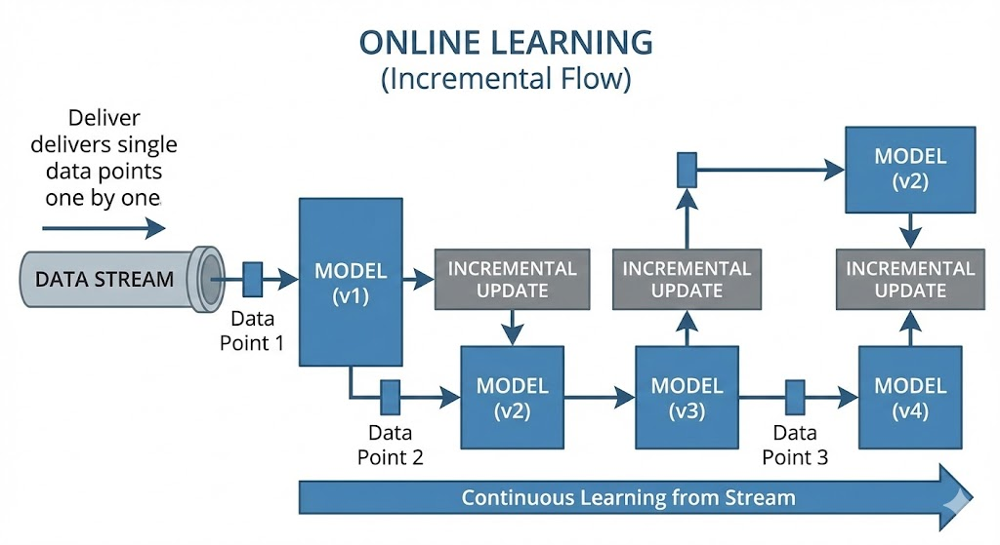
---


## Instance-Based Vs Model-Based Learning

### Core Concept: Memorisation vs Generalisation
- Instance-Based Learning is likened to a student who memorises or "rote learns" the material without understanding the logic.
- Model-Based Learning is likened to a student who understands the underlying principles or concepts to solve problems.

### 1. Instance-based learning
this stores the training data itself and makes predictions by comparing new inputs to stored instances. This is also called lazy learners

There is no explicit general model built during training.

> Learning happens at prediction time, not training time.

**How it works (intuition)**
- Think of memorization.
- You don’t learn a formula.
- You remember past examples and say:
  
> “This new case looks similar to that old case, so the answer should be similar.”

**Simple Example**

House price prediction (KNN)

``` text
    Training data:

    House A → ₹50L
    House B → ₹60L
    House C → ₹55L
```
New house arrives:
- Find nearest houses
- Average their prices
- Predict price

No training equation. Just comparison.

**Common Algorithms**
- K-Nearest Neighbors (KNN)
- Case-Based Reasoning
- Locally Weighted Regression

### 2. Model-Based Learning
Model-based learning builds a general mathematical model from the training data and discards most of the raw data.

> Learning happens during training, not prediction.


**How it works (intuition)**

Instead of memorizing examples, you learn rules.

Example:

> “House price = 10L + 5L × number of rooms”

That rule is the model.

**Simple Example**

Linear Regression
Training:
- Learns weights and bias
- Creates a function:
- price = w₁x₁ + w₂x₂ + b

Prediction
- Just plug values into the equation

**Common Algorithms**
- Linear / Logistic Regression
- Decision Trees
- SVM
- Neural Networks
- Random Forest
- XGBoost

---


## Challenges in ML
Based on the video "Challenges in Machine Learning," the challenges faced during the machine learning life cycle can be categorised into data-related issues, model performance issues, and operational/deployment hurdles.

Here is a summary of the ten key challenges discussed:

### 1. Data-Related Challenges
A significant portion of machine learning involves managing data. It is estimated that professionals spend approximately **60% of their time** (or 8 months of a year) just cleaning and preparing data.

1.  **Data Collection:** While data is easily available in CSV formats for college courses, gathering data in a real-world corporate environment is difficult. It often requires complex automation or web scraping to consolidate data from various sources.
2.  **Insufficient Data:** The amount of data often matters more than the algorithm itself. A mediocre algorithm with a massive amount of data can outperform a superior algorithm with limited data. However, obtaining "sufficient" data is often not possible for every problem.
3.  **Non-Representative Data (Sampling Bias):** If the training data does not accurately reflect the real world, the model will fail. The speaker uses the example of surveying only Indians about who will win the Cricket World Cup; the result will be biased towards India and will not represent the global probability. This is known as **sampling noise** or bias.
4.  **Poor Quality Data:** Real-world data is often "noisy," containing errors, outliers, or missing values. If the data quality is poor ("Garbage In"), the model's output will also be poor ("Garbage Out").
5.  **Irrelevant Features:** Datasets often contain columns (features) that do not contribute to the prediction, such as a "Location" column when predicting fitness levels based on height and weight. Including these irrelevant features can degrade the model's performance, requiring careful **Feature Engineering** to select only the useful inputs.

### 2. Model Performance Challenges
These challenges relate to how well the algorithm "learns" from the data.

6.  **Overfitting:** This occurs when a model "memorises" the training data rather than understanding the underlying patterns. The model performs perfectly on training data but fails on new, unseen data because it has created overly complex rules to fit every single data point.
7.  **Underfitting:** This is the opposite of overfitting, where the model is too simple to capture the complexity of the data. For example, drawing a simple straight line through a complex, curved dataset results in poor performance on both training and testing data.

### 3. Operational and Deployment Challenges
The final set of challenges arises when moving the model from a developer's computer to a live product.

8.  **Software Integration:** Integrating a machine learning model into a final software product (like an Android app or a website) is difficult. Many platforms (e.g., Java-based systems or older operating systems) may not support modern ML libraries effectively, requiring significant effort to make them compatible.
9.  **Offline Learning and Deployment:** Deploying a model is complex, and keeping it updated is even harder. In traditional **Offline Learning**, the model does not learn from new data automatically. To update it, you must take the system offline, retrain it, and redeploy it, which is a cumbersome process.
10. **Cost Involved:** There are significant hidden costs associated with running machine learning models in production. Using cloud services (like AWS) to host models for thousands of users can generate unexpectedly high bills. This has led to the rise of **MLOps** (Machine Learning Operations), a field dedicated to managing the deployment and costs of ML systems efficiently.
---


## Applications of ML
The most significant financial impact of Machine Learning (ML) is found in **Business-to-Business (B2B)** sectors.

Here is a summary of how ML is applied across five key industries:

### 1. Retail and E-Commerce
Machine learning is critical for inventory management and targeted marketing in the retail sector.
*   **Inventory Management (Amazon):** During major sales events (like the Great Indian Festival), it is financially risky to stock up on all 60 million products indiscriminately. Data scientists use ML on historical sales data to predict exactly which products will sell, preventing stock shortages or wasted inventory.
*   **Customer Profiling (Offline Retail):** Physical stores like Big Bazaar request your phone number to track your buying behaviour. If you buy health products, the system tags you as "health-conscious." This profile is sold to relevant third parties (like gyms), allowing them to send high-conversion, targeted SMS advertisements rather than spamming random people.
*   **Product Placement:** Retailers use techniques like Association Rule Learning to determine which products (e.g., diapers and beer) are frequently bought together, deciding their placement in the store.

### 2. Banking and Finance
*   **Loan Underwriting:** When a customer applies for a loan, ML algorithms analyse their profile against the history of past defaulters. If there is a strong correlation between the applicant's profile and previous defaulters, the algorithm predicts a high risk of non-repayment, and the loan is rejected. This replaces or assists human loan officers in decision-making.

### 3. Transportation (Ola and Uber)
*   **Surge Pricing:** The speaker explains that "surge pricing" is a mechanism to balance supply and demand, not just to increase profits. When demand is high (e.g., evening rush hour) but supply (drivers) is low, the algorithm increases the price in that specific geofenced area.
*   **Incentivising Drivers:** This price hike is communicated to drivers in nearby low-demand areas, incentivising them to move to the high-demand area to earn extra money. This ensures that customers eventually get a cab by artificially increasing the supply.

### 4. Manufacturing (Tesla)
*   **Predictive Maintenance:** Companies like Tesla use automated robotic arms for manufacturing. If a critical robot fails, production stops, causing massive delays.
*   **IoT and Sensors:** To prevent this, sensors monitor metrics like temperature and RPM. ML models analyse this stream of data to detect gradual anomalies (e.g., RPM dropping slightly over time). The system predicts a failure *before* it happens, allowing engineers to repair the machine during downtime without halting the entire production line.

### 5. Social Media (Sentiment Analysis)
The speaker describes a potential strategy for monetising social data using **Sentiment Analysis**.
*   **Concept:** This involves analysing text (like IMDb movie reviews) to determine if the writer's emotion is positive or negative.
*   **Stock Market Application:** During an election, a platform like Twitter could analyse millions of tweets to predict the winner (e.g., calculating a 70% win probability for a specific candidate). This insider intelligence can be sold to stockbrokers. The brokers then invest in companies likely to benefit from that candidate's victory before the results are public, generating massive profits when the stock prices rise post-election.

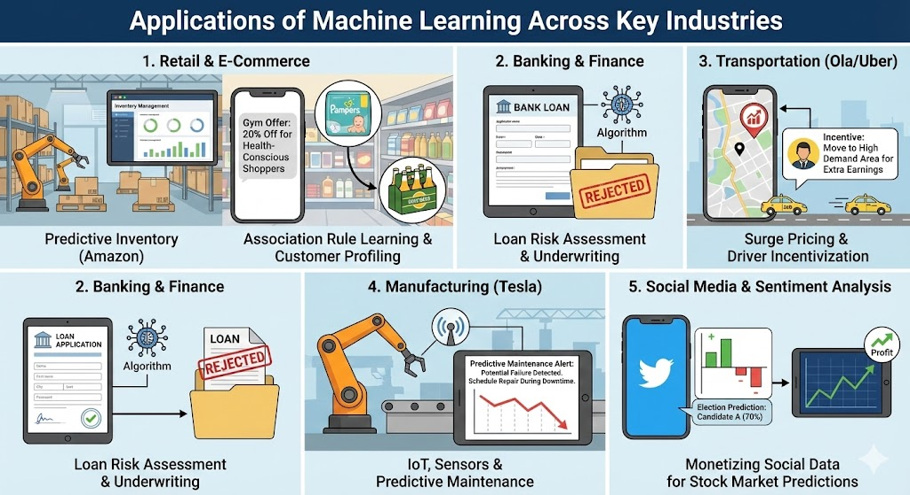

---


## MLDC (Machine Learning Development Life Cycle)

people often focus solely on model training, the industry requires professionals who can manage an end-to-end product life cycle. This life cycle consists of **nine distinct steps** that guide a project from an initial idea to a deployed product.

Here is a summary of the nine steps of the MLDLC:

### 1. Framing the Problem
Before writing any code, you must define the problem clearly. This involves identifying the specific problem to solve, who the customers are, the estimated costs, and the team size required. You must also decide on technical approaches early, such as whether the problem requires supervised or unsupervised learning, and whether it will run in batch or offline mode.

### 2. Gathering Data
Data is the fuel for machine learning. In a corporate environment, data is rarely as clean or accessible as it is in academic courses. Data may need to be sourced via:
*   **APIs:** Fetching JSON data programmatically.
*   **Web Scraping:** Extracting data from websites when no API is available.
*   **Data Warehouses:** Extracting data using ETL (Extract, Transform, Load) processes from SQL databases.
*   **Big Data Clusters:** Using tools like Spark for massive datasets.

### 3. Data Preprocessing
Raw data is often "dirty" and unsuitable for algorithms. This step involves cleaning the data by removing duplicates, handling missing values, correcting outliers, and fixing structural errors. The goal is to format the data so the machine learning algorithm can consume it effectively.

### 4. Exploratory Data Analysis (EDA)
The speaker compares this step to "sharpening the axe before cutting the tree". It involves analyzing the data to understand the relationship between inputs and outputs before building models. Techniques include univariate and multivariate analysis and data visualisation to understand hidden patterns or imbalances in the dataset.

### 5. Feature Engineering and Selection
*   **Feature Engineering:** Creating new, more useful input columns from existing ones. For example, combining "number of rooms" and "number of bathrooms" to create a "total square footage" feature.
*   **Feature Selection:** Removing irrelevant columns that do not impact the output. This is crucial because too many features can slow down training and degrade performance.

### 6. Model Training
Rather than relying on a single algorithm, you typically train multiple algorithms (from different families) on the data to see which performs best. This is an experimental phase where you try everything to find the best fit.

### 7. Evaluation and Model Selection
Once models are trained, they are evaluated using performance metrics (such as accuracy or confusion matrices).
*   **Hyperparameter Tuning:** You adjust the "settings" of the algorithm to squeeze out better performance.
*   **Ensemble Learning:** You may combine multiple models (using techniques like Bagging, Boosting, or Stacking) to create a more powerful, combined model.

### 8. Deployment
This step converts the machine learning model into a usable software product. The model is typically exported as a binary file (e.g., using pickle) and integrated into a web or mobile application via an **API**. The application is then hosted on cloud servers like AWS or Google Cloud Platform so real users can access it.

### 9. Testing and Optimization
After deployment, the work continues:
*   **A/B Testing:** Releasing the model to a small group of trusted users (Beta testing) to gather feedback before a full rollout.
*   **Model Rotting:** The speaker introduces the concept of "rotting," where a model's performance degrades over time because real-world data evolves (e.g., new types of face masks appearing requiring an update to a face-detection model).
*   **Automation:** Setting up automated pipelines to retrain the model frequently and manage backups and load balancing.

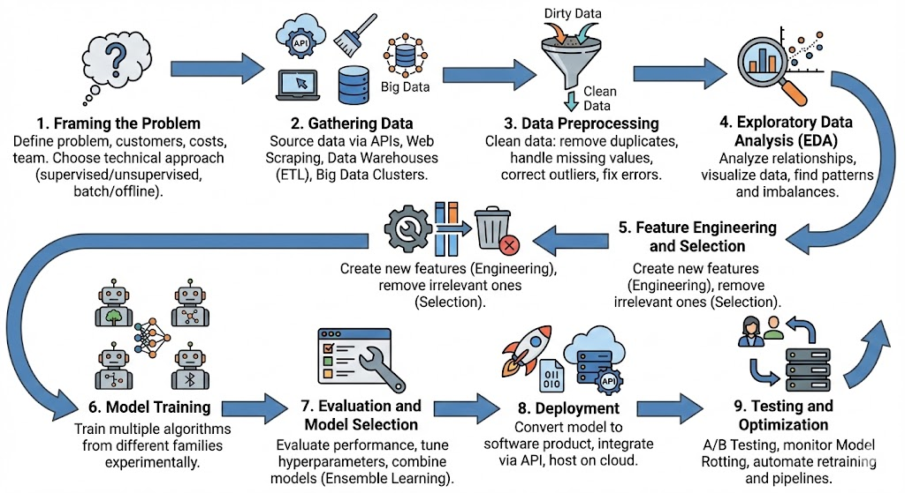

---


## Tensors

### 1. What is a Tensor?

A **tensor** is a **data structure used to store numerical data**.  
In machine learning and deep learning, almost all data is represented as tensors.

While tensors can theoretically store characters or strings, ML frameworks work almost entirely with numbers.

### 2. Why Tensors Are Important

- Fundamental building blocks of ML and DL libraries
- Models accept tensors as input and output tensors
- All neural network operations are tensor operations

### 3. Mathematical Background

The term *tensor* originates from mathematics and physics.

| Dimension | Name   |
| --------- | ------ |
| 0D        | Scalar |
| 1D        | Vector |
| 2D        | Matrix |
| 3D+       | Tensor |

### 4. Key Tensor Terminology

- **Rank (Axes)**
    - Number of dimensions in a tensor. 
    - (eg., A 2D matrix has a rank of 2 (rows and columns)).

- **Shape**
    - Number of elements along each dimension.
    - (e.g., a matrix with 2 rows and 3 columns has a shape of 2x3).

- **Size**
    - Total number of elements in the tensor.
    - (e.g., a 2x3 matrix has a size of 6).

### 5. Tensor Types with Examples

#### 0D Tensor (Scalar)
*   **Definition:** Single numeric value.
*   **Example** Student CGPA = 9.2

**Numeric data:**
```text
7
```
- Rank: 0
- Shape: ()
- Size: 1


#### 1D Tensor (Vector)
*   **Definition:** Collection of scalars.
*   **Example** One student’s features → [CGPA, IQ, State]

**Numeric data:**
```text
[2, 4, 6, 8]
```
- Rank: 1
- Shape: (4,)
- Size: 4
- mathematically → vector with 4-dimensions
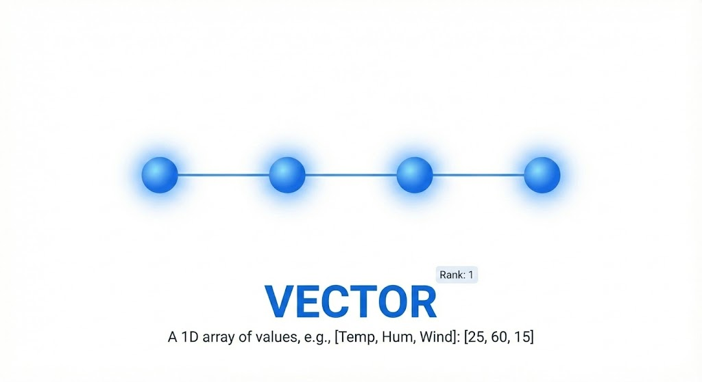

#### 2D Tensor (Matrix)
*   **Definition:** Collection of vectors.
*   **Example** Entire student dataset (rows × columns)

**Numeric data:**
```text
[
  [1, 2, 3],
  [4, 5, 6]
]
```
(rows = samples, columns = features)
- Rank: 2
- Shape: (2, 3)
- Size: 6
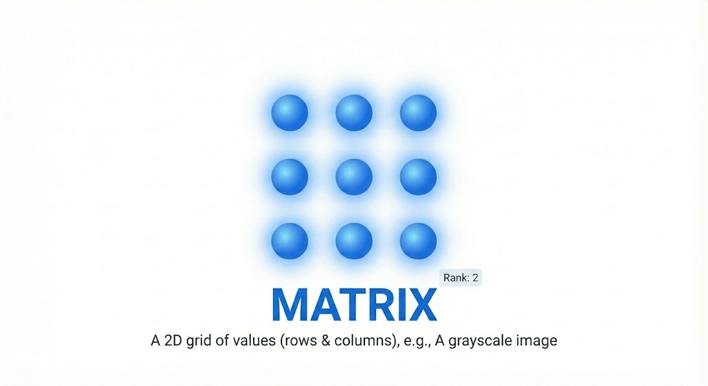

#### 3D Tensor
*   **Definition:** Collection of matrices.
*   **Example**
- Single RGB image (H × W × 3)
- NLP sentence embeddings
*   **Example 1 (NLP):** In Natural Language Processing, a sentence consists of words. If every word is converted into a vector, the sentence becomes a 2D matrix. A collection of multiple sentences therefore becomes a 3D tensor.
*   **Example 2 (Time Series):** Stock market data tracking high/low prices (2D) over a period of 10 years results in a 3D tensor.
*   **Example 3 (Single Image):** A standard color photograph is a 3D tensor defined by Height × Width × 3 Color Channels (Red, Green, Blue).

**Numeric data:**
```text
[
  [
    [1, 2, 3],
    [4, 5, 6]
  ],
  [
    [7, 8, 9],
    [10,11,12]
  ]
]
```
- Rank: 3
- Shape: (2, 2, 3)
- Size: 12


#### 4D Tensor
*   **Definition:** Collection of 3D tensors.
*   **Example** Batch of images (Batch × H × W × C)
*   **Example (Image Batch):** In Deep Learning (Computer Vision), algorithms process batches of images rather than single images. A batch of 50 color images is represented as: **50 (Images) × Height × Width × 3 (Channels)**. This constitutes a 4D tensor.


#### 5D Tensor
*   **Definition:** Collection of 4D tensors.
*   **Example** Batch of videos (Videos × Frames × H × W × C)
*   **Example (Videos):** A video is essentially a sequence of images (frames) playing rapidly.
    *   A single video is 4D: **Frames × Height × Width × Channels**.
    *   A **batch of videos** (e.g., 4 videos) creates a 5D tensor: **Number of Videos × Frames × Height × Width × Channels**.


### 6. Storage Consideration

Raw tensors consume large memory.
*   **Example** A few uncompressed videos can occupy tens of GBs.


### 7. Summary Table

| Rank | Tensor | Example     |
| ---- | ------ | ----------- |
| 0    | Scalar | Loss value  |
| 1    | Vector | Single row  |
| 2    | Matrix | Dataset     |
| 3    | Tensor | Image       |
| 4    | Tensor | Image batch |
| 5    | Tensor | Video batch |

| Object | Tensor Rank (Dimension) | Example         |
| ------ | ----------------------- | --------------- |
| Scalar | 0-D tensor              | `5`             |
| Vector | 1-D tensor              | `[1,2,3,4]`     |
| Matrix | 2-D tensor              | `[[1,2],[3,4]]` |
| Tensor | 3-D or more             | `[[[...]]]`     |


### 8. Key Takeaways

- Tensors are numeric containers
- Rank defines dimensions
- Shape defines structure
- Deep learning = tensor computation

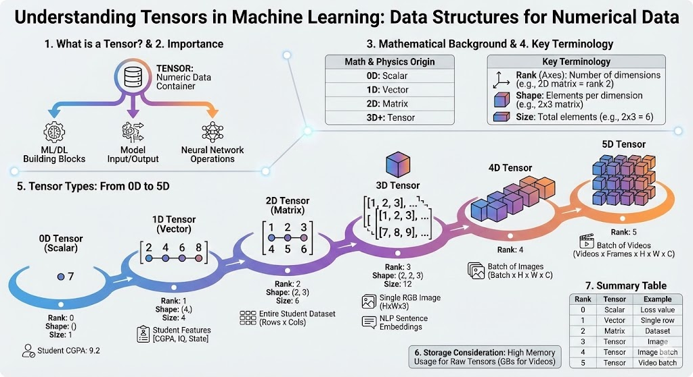

---


## Framing the Problem
The speaker emphasizes that while junior data scientists often focus on execution (cleaning data or training models), moving into leadership roles requires the ability to plan a project from scratch and convert a vague business requirement into a concrete machine learning task.

To explain this process, the video uses a case study of **Netflix** trying to increase its revenue.

### 1. Converting Business Problems to Mathematical Problems
The first step is translating a broad business goal into a specific mathematical objective.
*   **The Business Goal:** In a meeting, the goal is set to increase Netflix's revenue. Instead of finding new customers (which is hard) or raising prices (which angers customers), the team decides to focus on **customer retention**.
*   **The Metric:** The focus narrows to reducing the **Churn Rate** (the percentage of subscribers cancelling their subscription) from, for example, 4% to 3.75%.
*   **The Task:** The Data Scientist's job is not to *predict* the churn rate, but to **identify specific customers** who are about to leave so the company can intervene.

### 2. Determining the Type of Problem (Classification vs. Regression)
Once the goal is clear, you must decide how the model will function.
*   **Initial Thought (Classification):** You might initially frame this as a classification problem: "Will this customer leave? Yes or No." If "Yes," you offer them a discount to stay.
*   **Refinement (Regression):** Through discussion, you realise that not all customers are equally likely to leave. Some are 90% likely, others only 20%. Offering a flat 50% discount to everyone is financially inefficient.
*   **Final Frame:** It is better to frame this as a **Regression problem** where the model predicts the **probability (0–100%)** of a customer leaving. This allows the business to offer high discounts to high-risk users and lower discounts to low-risk users.

### 3. Assessing Existing Solutions
Before building something new, check if a solution already exists. You should consult with the CTO or colleagues to see if a simple churn model or heuristic is already in place. This avoids "reinventing the wheel" and provides a baseline to improve upon.

### 4. Data Strategy
You must identify what data is required and where to get it.
*   **Feature Identification:** You brainstorm factors that indicate a user is unhappy, such as:
    *   **Watch Time:** Is it decreasing?
    *   **Search History:** Are they searching for movies that are *not* on the platform (failed searches)?
    *   **Incompletion:** are they pausing movies halfway and abandoning them?.
*   **Data Engineering:** You cannot fetch this data alone. You must define these requirements for a **Data Engineer**, who will build a data warehouse containing these specific attributes for you.

### 5. Defining Metrics and Evaluation
You must establish how success will be measured.
*   **Offline Metrics:** Precision and Recall.
*   **Business Metrics:** After deployment, you must track if the churn rate actually dropped (e.g., from 4% to 3.75%) and ensure you are identifying the correct people.

### 6. Online vs. Batch Learning
You must decide how the model will learn.
*   **The Decision:** While **Online Learning** (learning in real-time) seems attractive, user behaviour is volatile (e.g., changing rapidly during holidays or lockdowns).
*   **The Solution:** The speaker suggests **Batch Learning** (Offline) is safer. The model can be retrained weekly using the latest data rather than reacting instantly to potentially noisy real-time data.

### 7. Checking Assumptions
Finally, before coding, you must validate your assumptions.
*   **Data Availability:** You assumed "failed search" data exists, but you must verify this with engineering.
*   **Generalisation:** You might assume one model works globally, but user behaviour in India might differ significantly from the US, potentially requiring separate models.

### Conclusion
The video concludes that spending time on this "thought process" prevents costly mistakes later. Successful data scientists are those who can plan the entire architecture of a solution before writing a single line of code.


## Analyzing Data
### Understanding Your Data

The video serves as the first part of a four-video series dedicated to analyzing data. Before diving into complex Exploratory Data Analysis (EDA) in future episodes, this session focuses on **seven basic questions** you should ask immediately upon loading a dataset (using the Titanic dataset as an example).

#### 1. How big is the data?
The first step is to understand the scale of the dataset you are dealing with.
*   **Method:** Use `df.shape`.
*   **Purpose:** This tells you the number of rows and columns, which helps in planning memory resources and processing time.

#### 2. What does the data look like?
You need to see the actual values to understand the structure.
*   **Method:** While `df.head()` gives the top 5 rows, the speaker recommends using **`df.sample(5)`**.
*   **Reason:** Data is often sorted or biased at the beginning or end. `sample()` picks rows randomly, providing a more unbiased representation of the dataset to avoid forming incorrect assumptions early on.

#### 3. What are the data types of the columns?
It is crucial to know which columns are numerical and which are categorical (objects).
*   **Method:** Use `df.info()`.
*   **Purpose:** This function reveals missing values and data types. It also shows **memory usage**.
*   **Optimization:** You can identify opportunities to save memory, such as converting a column strictly containing integers but stored as floats (decimal values) into an integer format. This reduces the dataset size and speeds up algorithm processing.

#### 4. Are there missing values?
Missing data can break models and must be handled (either by dropping or filling).
*   **Method:** Use `df.isnull().sum()`.
*   **Insight:** This provides a count of missing values for every column. For example, in the video, the 'Cabin' column had many missing values, while 'Age' had fewer. This helps you decide whether to remove the column entirely or impute the missing values.

#### 5. How does the data look mathematically?
For numerical columns, you need a high-level mathematical summary.
*   **Method:** Use `df.describe()`.
*   **Purpose:** This displays statistics like **count, mean, standard deviation, minimum, and quartiles (25%, 50%, 75%)**.
*   **Insight:** It helps identify anomalies. For instance, looking at the minimum and maximum age in the Titanic dataset reveals if the data range makes logical sense (e.g., minimum age 0.42 denotes an infant).

#### 6. Are there duplicate values?
Duplicate rows can negatively affect the training of a machine learning model.
*   **Method:** Use `df.duplicated().sum()`.
*   **Action:** If the count is greater than zero, duplicates should be removed immediately.

#### 7. How do the columns correlate with each other?
Correlation measures the relationship between two variables, specifically between input columns and the output (target) column.
*   **Method:** Use `df.corr()`.
*   **Interpretation:**
    *   **Positive Correlation:** When one value increases, the other increases. In the Titanic example, **Fare** has a positive correlation with **Survival** (wealthier passengers had a better chance of survival).
    *   **Negative Correlation:** When one value increases, the other decreases. **Pclass** (Passenger Class) has a negative correlation with Survival (as the class number increases from 1 to 3, the quality decreases, and survival chances drop).
    *   **No Correlation:** Columns like `PassengerId` have near-zero correlation and are essentially useless for prediction.

**Next Steps:**
The speaker notes that while these steps are preliminary, the following videos will cover **Univariate Analysis** (analyzing columns individually), **Multivariate Analysis**, and automated analysis using **Pandas Profiling**.


### EDA using Univariate Analysis 

#### What is Univariate Analysis?
Exploratory Data Analysis (EDA) is the process of understanding your data "inside out".
*   **Definition:** "Univariate" combines "Uni" (one) and "Variate" (variable). It refers to the analysis of a single column independently.
*   **Goal:** Unlike Bivariate (two columns) or Multivariate (more than two columns) analysis which looks for relationships, Univariate analysis focuses solely on understanding the nature and distribution of one specific feature at a time.

#### Step 1: Identify Data Types
Before analyzing, you must categorize the column type, as this dictates the approach:
1.  **Categorical Data:** Represents groups or classes (e.g., Gender, Nationality, College Branch, Survived/Not Survived).
2.  **Numerical Data:** Represents quantitative measurements (e.g., Height, Weight, Age, Price).

The speaker demonstrates this using the **Titanic dataset**, categorizing columns like `Survived` and `Pclass` (Passenger Class) as categorical, and `Age` and `Fare` as numerical.


#### Analyzing Categorical Data
For categorical columns, the primary goal is to understand the frequency or percentage of each category.

**1. Countplot**
*   **Function:** Visualizes the frequency (count) of each category.
*   **Insight:** Using the `seaborn` library (`sns.countplot`), the speaker reveals that out of 891 passengers, significantly more people died (0) than survived (1). Similarly, for `Pclass`, it showed that Class 3 had the highest number of passengers, while Class 2 had the lowest.

**2. Pie Chart**
*   **Function:** Visualizes the data as percentages rather than raw numbers.
*   **Insight:** By using parameters like `autopct`, you can see the exact distribution breakdown.
    *   **Example:** On the Titanic, 61.6% of people died, and 55% of all passengers were traveling in Class 3.


#### Analyzing Numerical Data
For numerical columns (like `Age`), knowing the frequency of every single unique number is often useless. Instead, the focus shifts to distribution, density, and outliers.

**1. Histogram**
*   **Function:** It groups continuous data into ranges called "bins".
*   **Insight:** It shows the distribution of data. For the `Age` column, the histogram revealed that very young children and very old people were fewer in number, while the majority of passengers were in the middle age range (20s to 40s).
*   **Customisation:** You can adjust the number of bins to make the graph more granular or broader.

**2. Distplot (Distribution Plot) & KDE**
*   **Function:** This creates a histogram overlaid with a curve called the **KDE (Kernel Density Estimation)**.
*   **Concept (PDF):** The curve represents the **Probability Density Function (PDF)**. The Y-axis represents probability rather than count.
*   **Insight:** It allows you to calculate the probability of a specific value occurring (e.g., "What is the probability of a passenger being 40 years old?"). It is also essential for identifying **Skewness** (see below).

**3. Boxplot**
*   **Function:** Provides a "5-number summary" of the data: Minimum, Q1 (25th percentile), Median (50%), Q3 (75th percentile), and Maximum.
*   **Key Use Case:** It is the primary tool for detecting **Outliers** (noise).
*   **Logic:** Any data point falling outside the calculated range (1.5 times the Interquartile Range or IQR) is considered an outlier.
*   **Example:** The `Fare` column boxplot showed massive outliers (e.g., a ticket costing $500 when most were much lower), whereas `Age` had relatively few outliers.

---

#### Key Statistical Concepts Introduced

**Skewness**
While analyzing numerical data (via Distplots), you must check if the data is Symmetrical (Normal Distribution) or Skewed.
*   **Symmetrical:** The curve peaks in the center (bell curve).
*   **Skewed:** The curve leans to one side.
    *   **Example:** Salary data is usually skewed (many people earn low amounts, very few earn millions).
*   **Measurement:** You can use `df['column'].skew()` in Pandas.
    *   **0:** Perfectly symmetrical.
    *   **Positive:** Skewed right.
    *   **Negative:** Skewed left.

**Descriptive Statistics**
Beyond graphs, you should calculate specific metrics for numerical columns using Pandas functions:
*   `min()` and `max()` to find the range.
*   `mean()` to find the average.

#### Summary Table

| Data Type | Primary Question | Recommended Plots |
| :--- | :--- | :--- |
| **Categorical** | How frequent is each category? | Countplot, Pie Chart |
| **Numerical** | What is the distribution and are there outliers? | Histogram, Distplot, Boxplot |


## Gradient Descent


